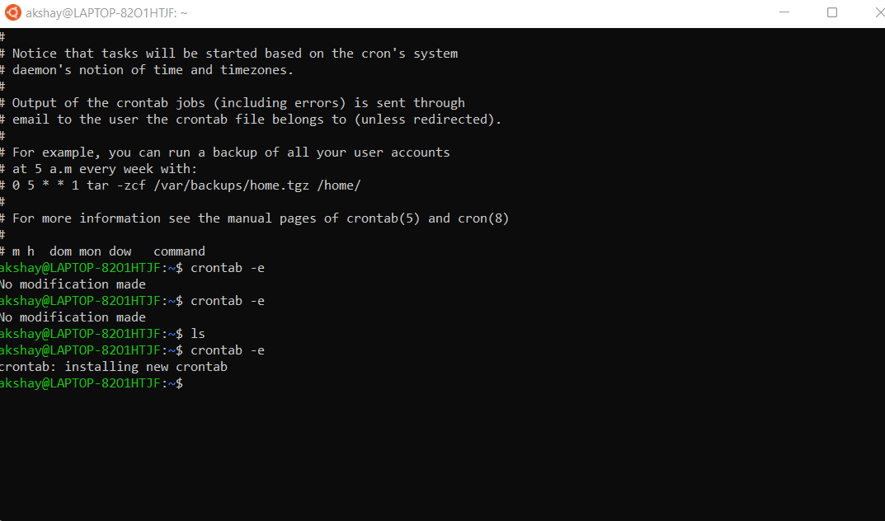
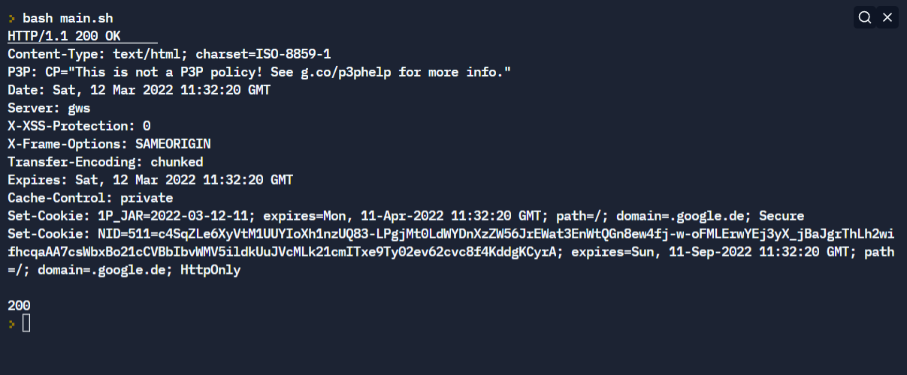
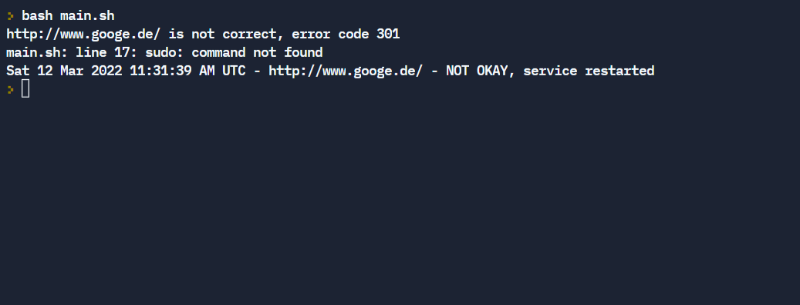

# SystemHaus Gmbh Task 

- The script now checks the URL/API-URI and gets the status of the response,

- If the URL/API-URI is down it restarts the service using the systemctl command given as `sudo systemctl reload Basissystem.service`

- added timeout of 5 minutes that is the maximum time for URL

- Tested for Cron as it helps to run the script each minute

    - Setup crontab by command `crontab -e`

    - Added the content to run the script each minute
    `* * * * * \home\test_script.sh` , after adding this terminal shows, this runs the script each minute (60 sec)

    

# Screenshots

- ## Output 1

- ## Output 2

# Description of Commands used

- bash- The bash command executes the shell scripts
- curl- This command is to transfer data from and to the server
- sed- This command is the stream editor in Linux
- cron- This command schedules the run at regular intervals
- systemctl (systemd)- This command manages system services.  
